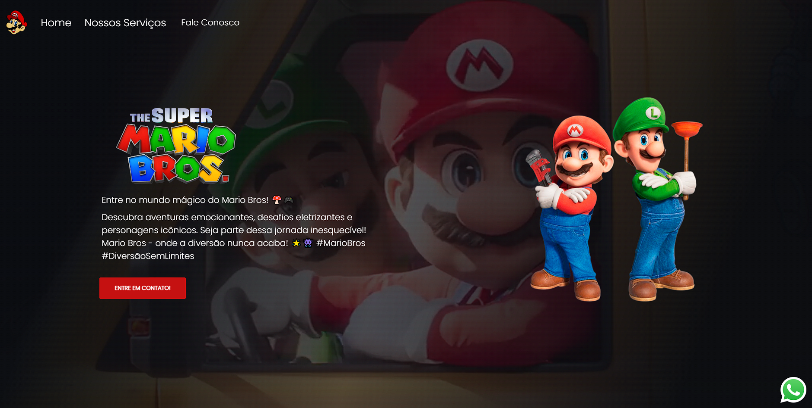

# Mario - Landing Page

## Descrição
O Mario é uma landing page desenvolvida para a divulgação de um serviço específico. Esta página foi criada com o objetivo de fornecer informações sobre o serviço e incentivar os visitantes a realizarem uma ação específica, como entrar em contato, fazer uma reserva ou se inscrever para receber mais informações.

## Funcionalidades Principais
- Descrição do serviço oferecido.
- Destaques sobre os benefícios e características do serviço.
- Testemunhos de clientes satisfeitos.
- Chamadas para ação (CTAs) para incentivar os visitantes a realizarem ações específicas.
- Informações de contato para os visitantes obterem mais informações ou fazerem perguntas.

## Tecnologias Utilizadas
- HTML5
- CSS3 (possivelmente com pré-processador SASS/SCSS)
- JavaScript (para interatividade, se necessário)
- Bootstrap (opcional, dependendo da preferência e necessidade de um framework CSS)
- Git (para controle de versão)

## Como Visualizar
1. Clone o repositório (`git clone https://github.com/AngeloHervis/Mario.git`).
2. Abra o arquivo `index.html` em seu navegador web.

## Autor
Angelo Hervis
- GitHub: [AngeloHervis](https://github.com/AngeloHervis)
- LinkedIn: [Angelo Hervis](https://www.linkedin.com/in/angelohervis/)

## Licença
Este projeto é licenciado sob a Licença MIT - veja o arquivo [LICENSE](LICENSE) para detalhes.
